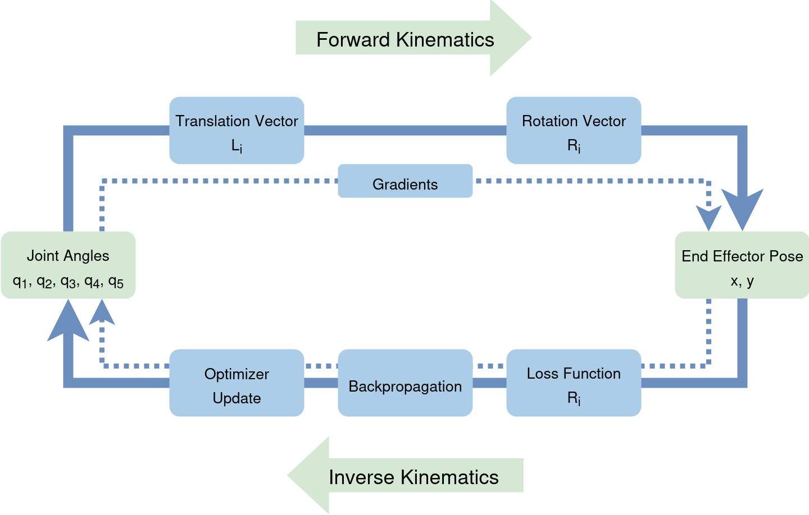
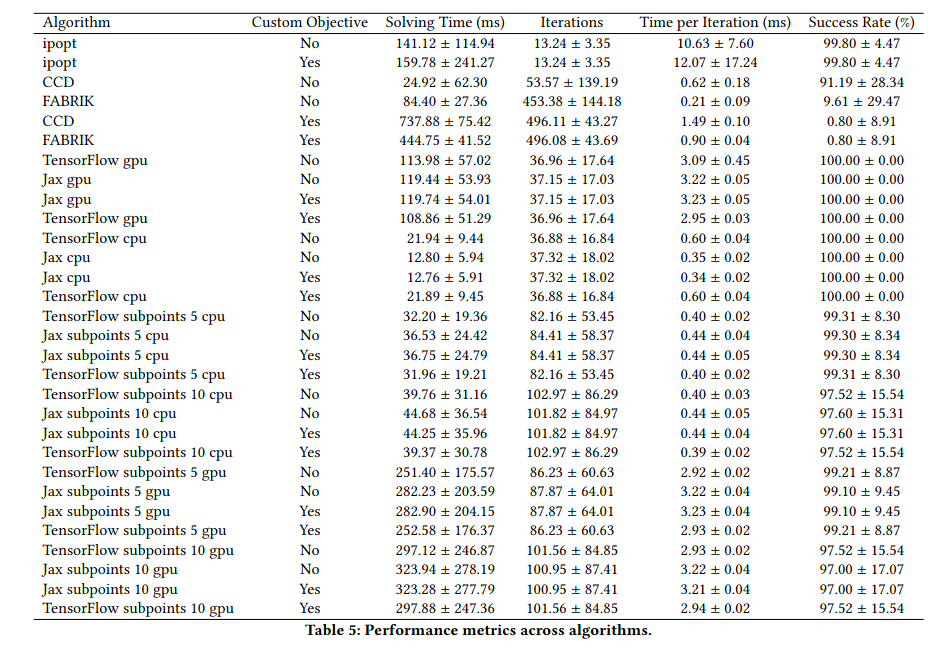

# JAX-IK

[](https://pypi.org/project/jax-ik/) [](https://creativecommons.org/licenses/by-nc-sa/4.0/) [](https://github.com/hvoss-techfak/JAX-IK/actions/workflows/python-app.yml)


Real-time inverse kinematics in pure JAX with differentiable objectives, trajectory support, and optional SDF-based self-collision.

- Paper: Real-Time Inverse Kinematics for Generating Multi-Constrained Movements of Virtual Human Characters: https://arxiv.org/abs/2507.00792
- Website: https://hvoss-techfak.github.io/JAX-IK/
- Demo (HF Space): https://huggingface.co/spaces/hvoss-techfak/JAX-IK

<p align="center">
  
</p>


## Highlights

- Fast, fully differentiable IK in JAX (CPU or GPU) with Adam-based solver
- Flexible objective system (distance, direction, pose anchors, derivatives, spacing)
- GLTF/GLB rig support (e.g., SMPL-X) and URDF robot support
- Optional SDF-based self-collision using mesh_to_sdf (falls back to trimesh)
- Simple forward kinematics (FK) API, plus helpers to deform meshes (LBS or rigid) for visualization
- Clean CLI for quick experiments and interactive PyVista rendering


## Installation

Prerequisites:

- Python 3.10+
- pip

The package depends on numpy, jax, pygltflib, trimesh, urchin, pyvista, tqdm, and mesh_to_sdf (optional but recommended). The default install targets CPU; GPU acceleration requires a CUDA 12 runtime and the JAX CUDA plugin.

Quick install (CPU):

```bash
pip install jax-ik
```

GPU (CUDA 12) notes:

- If you have CUDA 12 drivers and a compatible GPU, also install the CUDA plugin for JAX:

```bash
pip install --upgrade jax jax-cuda12-plugin
```

- If you run into device/plugin conflicts, prefer installing JAX as recommended by the JAX docs for your platform and driver, then install jax-ik:

```bash
# Install a device-specific JAX build per https://jax.readthedocs.io/
pip install --upgrade jax
# Then install JAX-IK
pip install jax-ik
```

From source (editable):

```bash
git clone https://github.com/hvoss-techfak/JAX-IK.git
cd JAX-IK
pip install -e .
```

Optional dependencies:

- mesh_to_sdf: Significantly speeds up SDF calculation; otherwise the code falls back to trimesh proximity queries.
- RTree: Improves certain trimesh operations.


## Quickstart

Below are two minimal examples. The first uses a SMPL-X character exported as GLB; the second uses a URDF robot.

Important: We cannot distribute SMPL-X assets with this repo. You must export your own GLB using the Meshcapade SMPL-X Blender Add-on.

### 1) GLTF/GLB (e.g., SMPL-X) — Reach a target with the wrist

```python
import numpy as np
from jax_ik.objectives import DistanceObjTraj
from jax_ik.ik import InverseKinematicsSolver

hand = "left"
controlled_bones = [
    f"{hand}_collar", f"{hand}_shoulder", f"{hand}_elbow", f"{hand}_wrist"
]

# Angle bounds in degrees for these bones (coarse but safe)
angle_bounds_deg = {
    "left_collar": ([-10, -10, -10], [10, 10, 10]),
    "left_shoulder": ([-120, -140, -65], [70, 50, 25]),
    "left_elbow": ([-100, -180, -10], [90, 10, 10]),
    "left_wrist": ([-120, -70, -70], [90, 60, 80]),
}

bounds = []
for bone in controlled_bones:
    lo, hi = angle_bounds_deg[bone]
    for l, h in zip(lo, hi):
        bounds.append((np.radians(l), np.radians(h)))

solver = InverseKinematicsSolver(
    model_file="smplx.glb",  # path to your exported SMPL-X GLB
    controlled_bones=controlled_bones,
    bounds=bounds,
    threshold=0.005,
    num_steps=1000,
)

end_effector = f"{hand}_wrist"
target = np.array([0.3, 0.2, 0.5])
mandatory = [
    DistanceObjTraj(target_points=[target], bone_name=end_effector, use_head=True)
]

initial = np.zeros(len(controlled_bones) * 3, dtype=np.float32)
angles, obj_value, steps = solver.solve(
    initial_rotations=initial,
    learning_rate=0.2,
    mandatory_objective_functions=mandatory,
    ik_points=5,
    patience=200,
)

print(f"Solved in {steps} steps. Final objective: {obj_value:.4f}")
solver.render(angle_vector=angles[-1], target_pos=[target], interactive=True)
```

### 2) URDF — Reach a target with a specified end-effector

```python
import numpy as np
from jax_ik.objectives import DistanceObjTraj, BoneZeroRotationObj
from jax_ik.ik import InverseKinematicsSolver

# Example: Pepper URDF (you can use any URDF that urchin can load)
model = "/path/to/your_robot.urdf"
controlled = ["LShoulder", "LBicep", "LForeArm", "l_wrist"]
end_effector = "LFinger13_link"

solver = InverseKinematicsSolver(
    model_file=model,
    controlled_bones=controlled,
    bounds=None,  # Uses URDF joint limits when available
    threshold=0.005,
    num_steps=10000,
)

target = np.array([0.3, 0.3, 0.35])
mandatory = [DistanceObjTraj(target_points=[target], bone_name=end_effector, use_head=True)]
optional = [BoneZeroRotationObj(weight=0.25)]

initial = np.zeros(len(controlled) * 3, dtype=np.float32)
angles, obj_value, steps = solver.solve(
    initial_rotations=initial,
    learning_rate=0.2,
    mandatory_objective_functions=mandatory,
    optional_objective_functions=optional,
    ik_points=5,
)

print(f"Solved in {steps} steps. Final objective: {obj_value:.4f}")
solver.render(angle_vector=angles[-1], target_pos=[target], interactive=True)
```


## Command Line (CLI)

You can also run the solver from the command line. The CLI renders an initial pose, then incrementally solves for one or more targets, visualizing the result at the end.

Run with a GLB/GLTF (SMPL-X):

```bash
python -m jax_ik.ik \
  --model_file /path/to/smplx.glb \
  --hand left \
  --threshold 0.005 \
  --num_steps 5000 \
  --render
```

Run with a URDF:

```bash
python -m jax_ik.ik \
  --model_file /path/to/robot.urdf \
  --controlled_bones '["LShoulder","LBicep","LForeArm","l_wrist"]' \
  --end_effector_bone LFinger13_link \
  --threshold 0.005 \
  --num_steps 10000 \
  --render
```

Optional flags:

- --learning_rate: Adam step size (default 0.2)
- --additional_objective_weight: Weight for BoneZeroRotationObj (default 0.25)
- --target_points: JSON array of 3D points, e.g. '[[0.3,0.2,0.5]]'
- --subpoints: Number of time steps after the initial pose to optimize (trajectory length minus 1)


## Concepts and API

Core building blocks:

- FKSolver: Loads a skeleton (GLTF/GLB or URDF), prepares a topologically sorted hierarchy, and computes global transforms for any set of controlled Euler angles. Can optionally load a mesh and compute an SDF for self-collision.
- InverseKinematicsSolver: Thin wrapper around FKSolver that assembles bounds, runs the Adam-based optimizer, and exposes solve() / solve_guess() helpers and render().
- Objectives (jax_ik.objectives):
  - DistanceObjTraj: Make a bone head/tail reach one or more targets along the trajectory
  - BoneDirectionObjective: Align a bone with a given direction (e.g., wrist forward)
  - InitPoseObj: Attract a pose or the whole trajectory to a given pose (maskable)
  - DerivativeObj / CombinedDerivativeObj: Penalize velocity/acceleration/jerk
  - EqualDistanceObj: Encourage evenly spaced keyframes in joint space
  - SDFCollisionPenaltyObj: Keep a bone segment outside an SDF (environment)
  - SDFSelfCollisionPenaltyObj: Penalize deep intersections with the character mesh

Typical flow:

1) Decide which bones to control and provide angle bounds for each Euler component (XYZ per bone). URDF models can auto-derive conservative limits.
2) Build a list of objectives (mandatory and optional). Mandatory and optional are just two buckets combined in the final scalar loss.
3) Call solve() with an initial angle vector (or short trajectory). The solver handles JIT compilation and early stopping.
4) Inspect or render the result. You can also export frames with export_frames() / export_all_frames().


## SMPL-X assets note

We do not distribute SMPL-X meshes or skeletons. To obtain a GLB with SMPL-X:

- Install the SMPL-X Blender Add-on: https://github.com/Meshcapade/SMPL_blender_addon
- Use the add-on to create a character in Blender
- Export via File → Export → glTF 2.0 (.glb) and reference that file in examples/CLI

## Paper evaluation
This is the result of the evaluation, showing the average time taken by each IK algorithm in different configurations.
As you can see with the newest version of Jax, the jax implementation is now significantly faster than the newest
tensorflow version. \
This was calculated with Jax 0.6.2 and Tensorflow 2.19.0


## Troubleshooting

- JAX device selection: The project defaults to CPU in many examples. If you want GPU, ensure CUDA 12 drivers are installed and that JAX finds the plugin. If import errors mention jaxlib or plugins, install JAX as per the official instructions for your platform, then reinstall jax-ik.
- mesh_to_sdf is optional: If not installed, the SDF computation falls back to trimesh proximity queries (slower). For best performance: `pip install mesh_to_sdf`.
- URDF alignment: The loader converts URDF Z-up/X-forward to a Y-up/Z-forward visualization coordinate frame and recenters to keep the robot visible. For precise alignment with your simulator, you may need to tweak or disable those transforms in helper.py.
- Bone names: The CLI prints available bones. If a controlled bone or end-effector is missing, verify naming conventions in your model.
- Rendering: PyVista requires a working OpenGL context. On headless servers, try OSMesa or skip `--render`.


## Development

- Clone and install in editable mode: `pip install -e .`
- Run tests:

```bash
pip install pytest
pytest -q
```

- Code layout:
  - src/jax_ik: Main library (FK/IK, objectives, helpers)
  - tests/: Unit tests (solver, helpers, objectives)
  - paper_evaluation/: Scripts used for producing figures/ablation in the paper

Contributions are welcome via PRs. Please include tests for new functionality when possible.


## License

Real-Time Inverse Kinematics for Generating Multi-Constrained Movements of Virtual Human Characters © 2025 by Hendric Voss is licensed under CC BY-NC-SA 4.0.
